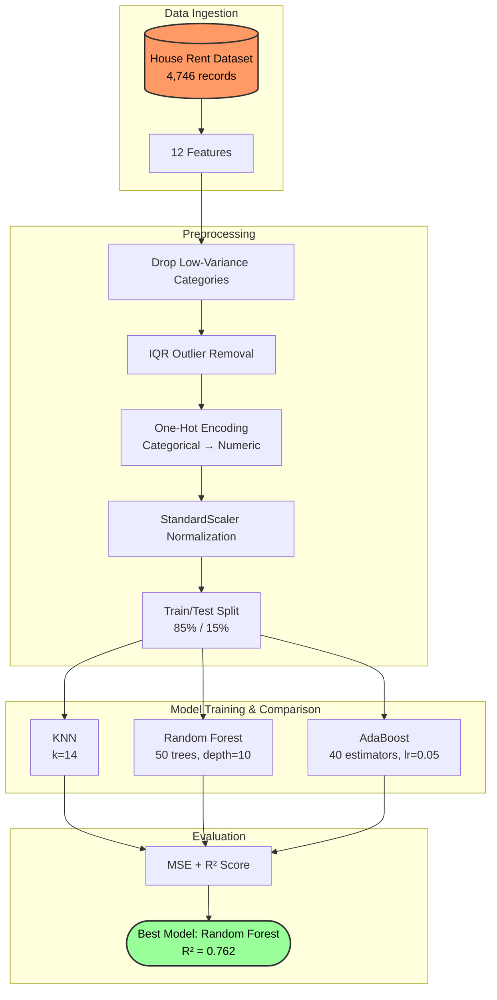

# House Price Predictive Analytics

[](https://www.python.org/)
[](https://scikit-learn.org/)
[](https://pandas.pydata.org/)
[](https://jupyter.org/)

A comparative regression analysis system that benchmarks three machine learning algorithms — **K-Nearest Neighbors (KNN)**, **Random Forest**, and **AdaBoost** — to predict house rental prices based on property attributes, location, and furnishing data from the Indian real estate market.

## 📊 System Pipeline



## 📖 Project Overview

The objective is to identify which factors most influence rental pricing in the Indian housing market and to determine the best-performing regression algorithm for price prediction. The system compares three fundamentally different approaches — instance-based learning (KNN), ensemble bagging (Random Forest), and ensemble boosting (AdaBoost) — providing insight into which paradigm best fits this domain.

## 🛠️ Methodology

### Data Preprocessing Pipeline

1. **Feature Selection**: Removes non-predictive columns (`Posted On`, `Floor`, `Area Locality`) that do not contribute to rental price determination.
2. **Outlier Handling**:
   - Drops categories with insufficient samples (`Built Area`: 2 records, `Contact Builder`: 1 record) to prevent model bias.
   - Applies **IQR-based outlier removal** across all numerical features, reducing noise from extreme values.
3. **One-Hot Encoding**: Converts categorical features (`Area Type`, `City`, `Furnishing Status`, `Tenant Preferred`, `Point of Contact`) into binary indicator columns.
4. **Standardization**: Normalizes numerical features (`BHK`, `Size`, `Bathroom`) using `StandardScaler` to zero mean and unit variance.
5. **Train/Test Split**: 85% training, 15% testing.

### Model Configurations

| Algorithm         | Key Parameters                    | Approach                                                                    |
| :---------------- | :-------------------------------- | :-------------------------------------------------------------------------- |
| **KNN**           | `n_neighbors=14`                  | Instance-based: predicts by averaging the K nearest training samples        |
| **Random Forest** | `n_estimators=50`, `max_depth=10` | Bagging ensemble: aggregates predictions from 50 independent decision trees |
| **AdaBoost**      | `n_estimators=40`, `lr=0.05`      | Boosting ensemble: sequentially corrects errors from weak learners          |

## 🧠 Technical Deep Dive

- **KNN Sensitivity to Scale**: KNN relies on distance metrics (Euclidean), making it highly sensitive to feature scales. The `StandardScaler` normalization step is critical. Without it, features like `Size` (range: 0-8000 sqft) would dominate over `Bathroom` (range: 1-3), producing skewed neighbor calculations.
- **Random Forest as Best Performer**: Random Forest achieves the lowest MSE because it naturally handles non-linear relationships and feature interactions (e.g., `City` × `Furnishing Status`) through its tree-based splits. The `max_depth=10` constraint prevents overfitting while preserving model expressiveness.
- **AdaBoost Limitations**: AdaBoost underperforms because the base learner (decision stump) struggles with the high-dimensional one-hot encoded feature space. The sequential boosting also amplifies the effect of remaining outliers in the dataset.
- **Feature Correlation Insight**: The correlation matrix reveals that `BHK`, `Size`, and `Bathroom` have weak direct correlation with `Rent`, while categorical features (especially `City` and `Furnishing Status`) are the strongest predictors, with Mumbai and fully furnished units commanding significantly higher rents.

## ⚙️ Backend Integration Potential

The trained models are lightweight and suitable for integration into a backend pricing service:

- **Model Serialization**: Any of the three trained scikit-learn models can be serialized via `joblib` or `pickle` for deployment in a REST API (e.g., FastAPI or Flask).
- **Inference Pipeline**: A prediction endpoint would accept property attributes (BHK, size, city, furnishing status, etc.), apply the same preprocessing pipeline (one-hot encoding + scaling), and return a predicted rental price.
- **Real-World Application**: This pipeline mirrors the backend logic used by property listing platforms to provide estimated rental ranges, helping property owners set competitive pricing.

## 📊 Dataset: House Rent Prediction

The system uses the [House Rent Prediction](https://www.kaggle.com/datasets/iamsouravbanerjee/house-rent-prediction-dataset) dataset:

- **4,746 records** with **12 features**
- **Cities**: Mumbai, Bangalore, Chennai, Delhi, Hyderabad, Kolkata
- **Target Variable**: `Rent` (continuous, in INR)

| Feature             | Type        | Description                              |
| :------------------ | :---------- | :--------------------------------------- |
| `BHK`               | int         | Number of bedrooms, halls, and kitchens  |
| `Size`              | int         | Property area in square feet             |
| `Bathroom`          | int         | Number of bathrooms                      |
| `City`              | categorical | City where the property is located       |
| `Furnishing Status` | categorical | Furnished / Semi-Furnished / Unfurnished |
| `Area Type`         | categorical | Super Area / Carpet Area                 |
| `Tenant Preferred`  | categorical | Family / Bachelors / Bachelors/Family    |
| `Point of Contact`  | categorical | Contact Agent / Contact Owner            |
| `Rent`              | int         | Monthly rental price (target)            |

## 🚀 Installation & Requirements

```bash
pip install pandas numpy scikit-learn matplotlib seaborn
```

## 📈 Results

### Model Accuracy (R² Score)

| Algorithm         | R² Score  |
| :---------------- | :-------- |
| **Random Forest** | **0.762** |
| KNN               | 0.701     |
| AdaBoost          | 0.655     |

### Mean Squared Error (×10³)

| Algorithm         | Train MSE  | Test MSE   |
| :---------------- | :--------- | :--------- |
| **Random Forest** | **21,371** | **45,316** |
| KNN               | 48,503     | 56,973     |
| AdaBoost          | 58,512     | 65,647     |

### Sample Prediction

| True Rent | KNN Prediction | RF Prediction | AdaBoost Prediction |
| :-------- | :------------- | :------------ | :------------------ |
| 13,500    | 21,785.7       | **12,756.4**  | 19,640.2            |

**Random Forest** produces the closest prediction to the true value, confirming its superiority for this dataset.

## 📂 Repository Structure

- `house_price_predictive_analytics.ipynb`: Complete pipeline with EDA, preprocessing, model training, and evaluation.
- `house_price_predictive_analytics.py`: Exported Python script of the notebook pipeline.

---

_Developed by Adita Putri Puspaningrum._
